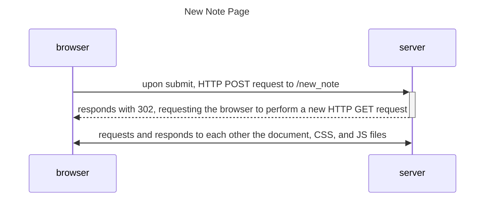

```mermaid
sequenceDiagram
    title: New Note Page

    participant browser
    participant server

    browser->>+server: upon submit, HTTP POST request to /new_note
    server-->>-browser: responds with 302, requesting the browser to perform a new HTTP GET request

    browser<<->>server: requests and responds to each other the document, CSS, and JS files    
```