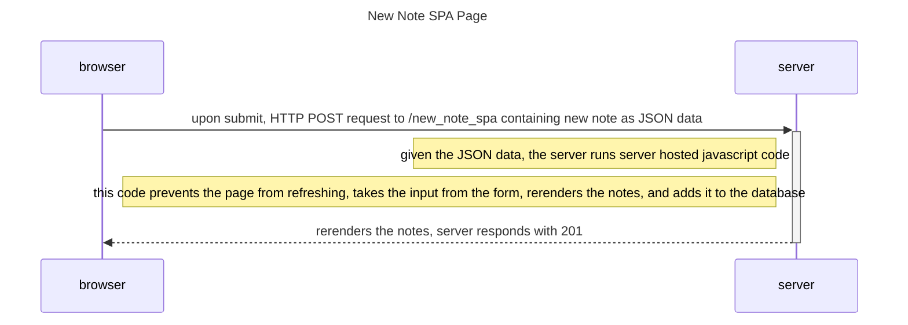

```mermaid
sequenceDiagram
    title: New Note SPA Page

    participant browser
    participant server

    browser->>+server: upon submit, HTTP POST request to /new_note_spa containing new note as JSON data

    Note left of server: given the JSON data, the server runs server hosted javascript code
    
    Note left of server: this code prevents the page from refreshing, takes the input from the form, rerenders the notes, and adds it to the database

    server-->>-browser: rerenders the notes, server responds with 201

```